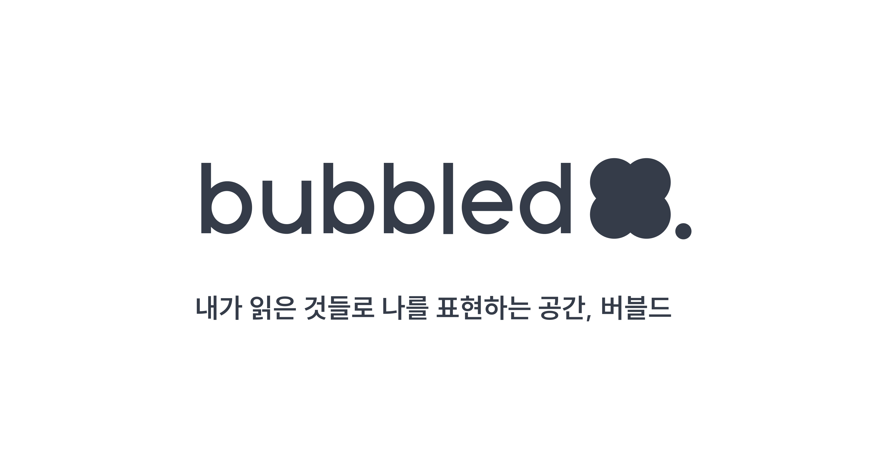

# 
 

## 🌟 서비스 소개
bubbled는 웹페이지 링크 저장(북마크) 및 공유 플랫폼 입니다.  
개발자, 디자이너, 취준생, 프로덕트 매니저, 대학생 등 다양한 사람들이 평소에 관심있는 분야의 글을 태그를 설정하여 모아놓을 수 있습니다.  
또한 다른 사용자들의 모아놓은 양질의 북마크들을 확인할 수 있으며 이메일을 통해 리마인드 기능을 활용하여 읽어야 할 글들을 확인할 수 있습니다.
 

## 🗝️ 주요 기능
- 아티클 폴더별 정리
- 아티클(링크, 북마크) 저장
- 검색기능으로 아티클, 폴더 검색
- 다른 사용자의 아티클과 폴더 열람
- 해당 아티클에 대한 리마인더 메일 수신
- 크롬 익스텐션을 통해 해당 웹페이지에서 바로 저장
 

## [bubbled 둘러보기](https://bubbled.at)
 
 

## 👫 bubbled 멤버
- **Front End**
    - 이정민(부팀장)([https://github.com/jeongmin-dev](https://github.com/jeongmin-dev))
    - 이윤수([https://github.com/yonslee](https://github.com/yonslee))
- **Back End**
    - 임현우(팀장)([https://github.com/hyunwoome](https://github.com/hyunwoome))
    - 이영욱([https://github.com/wowba](https://github.com/wowba))
    - 김수동([https://github.com/Sudongk](https://github.com/Sudongk))
- **Designer**
    - 이가인
    - 이경미
 

## 🏢 프로젝트 아키텍쳐

 

## 🔍  API
##[bubbled API 리스트](https://jlog.notion.site/fd1d1c5c6a3c42bbbfe18d4cf029c284?v=e7f88371b99b4da895856e98dc20432a)
 

## 🔧 사용 기술
- React.lazy
  React.lazy 메서드를 사용해 코드 스플리팅을 하여 지연로딩을 실행함으로써 앱의 초기 로딩 시간을 단축
- axios / interceptors
  axios interceptors를 사용해 JWT 엑세스 토큰 만료시 토근 재발급 및 비로그인과 로그인 분리 요청 관리
- redux / redux-toolkit
  효과적인 상태관리를 위해 리덕스와 개발도구로 리덕스 툴킷을 사용. 코드를 한곳에 모아 관리가 용이하며 유지보수 효율을 향상
- styled-components
  재사용성과 유지보수를 위해 스타일드 컴포넌트를 사용. 반복적인 컴포넌트들을 props에 따라 간편하게 스타일링
- Github Actions
  Githun Actions를 통한 CI/CD로 새로 적용된 코드를 서버에서부터 유저까지 짧은 주기로 제공
- AWS S3
- AWS CloudFront
 

## 📌 Library

|       library     |   description   |
|:-----------------:|:---------------:|
|        axios      |   서버 비동기 통신  |
|    lottie-web     |  이미지 애니메이션  |
|    react-slick    |  carousel 구현   |
|  react-responsive |   반응형 웹 구현   |
|       redux       |     상태관리      |
|    redux-logger   |  리덕스 흐름 체크   |
| styled-components |  css, 미디어쿼리  |
|     sweetalert2   |     알람구현     |
 

## ⚠️ 트러블 슈팅

### carousel(스와이프) 및 모달
- Issue - carousel과 모달을 구현하기 위해 프레이머를 사용했지만,
 과도하게 부드러운 애니메이션이 우리 프로젝트와 맞지 않는다고 결론을 내림
- Approach - 프레이머를 사용하지 않기로 결정, 간결함에 초점을 맞춰 horizontal-scroll-bar를 찾았으나,
		한 장씩 움직이는 모션은 구현하기 어려워서 react-slick을 도입
- Solution - carousel은 react-slick, alert은 sweet-alert을 사용했으며, 
	       모달 및 드롭다운 등은 기존에 있는 라이브러리를 사용하면 커스텀하기 까다롭고 
	       우리 프로젝트와는 어울리지 않아 직접 구현해서 사용

### 서비스워커를 통한 크롬 익스텐션 프로토콜 우회
- Issue - 링크를 저장하는 기능이 사용자의 DB에 접근하기 위해선 로그인이 필수, 하지만 카카오에선
	  크롬익스텐션 (chrome-extension://) 프로토콜을 지원하지 않아서 리디렉션이 불가
- Approach - 서비스워커에서 저희 홈페이지를 연결한 뒤, 실질적인 작업은 이곳 서비스워커에서 이루어지도록 멘토링을 통해 조언
- Solution - 토큰 및 입력받은 데이터를 로컬스토리지에 저장하고, 서비스워커에서 로컬스토리지의 이벤트 감지, 연결된 버블드 홈페이지에서 로컬의 데이터를 전송

### s3 배포 시 환경변수 파일(.env) 파일 미적용
- Issue - 환경변수(.env) 파일에 개발주소(로컬)와 도메인주소를 함께 넣어 사용중이었는데 s3로 배포가 될 때 주석처리 한 부분이 적용되지 않는 문제가 발생
- Approach - .env 파일을 .env.local 과 .env.production 으로 나누어 두어 배포시에는 .env.production 적용
- Solution - AWS CloudFront의 캐싱기간은 기본 24시간으로 업데이트 주기가 명확치 않으나 해당 서비스 안에 무효화 탭을 통해 컨텐츠가 만료되기 전 파일을 무효화 하여 엣지 캐시에서 객체(파일)을 제거
